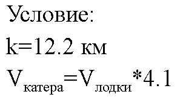
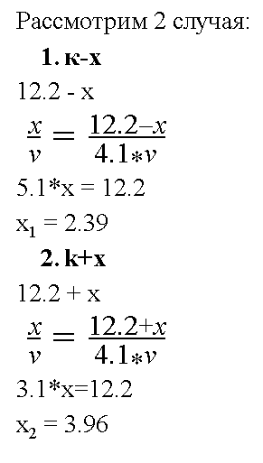
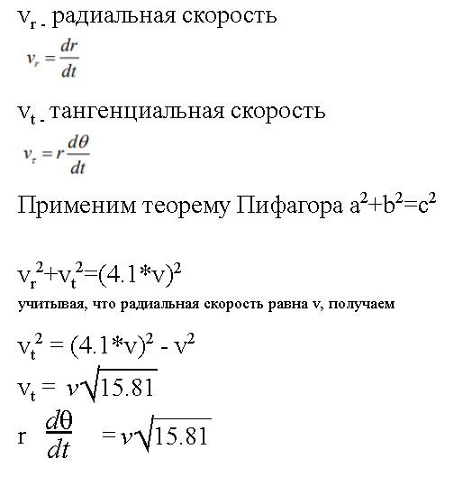
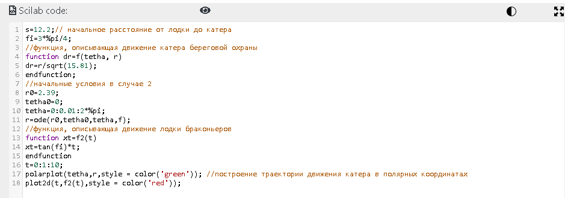
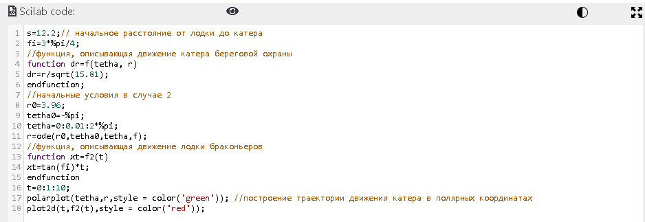
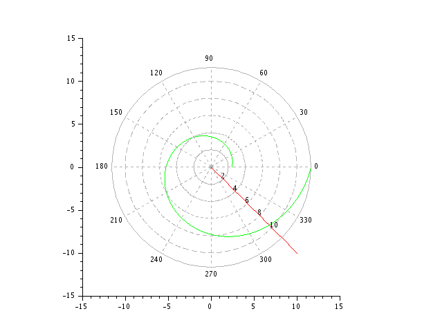
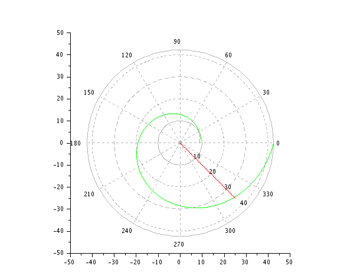

---
# Front matter
lang: ru-RU
title: "Шаблон отчёта по лабораторной работе №2"
subtitle: "Задача о погоне"
author: "Шувалов Николай Константинович"

# Formatting
toc-title: "Содержание"
toc: true # Table of contents
toc_depth: 2
lof: true # List of figures
lot: true # List of tables
fontsize: 12pt
linestretch: 1.5
papersize: a4paper
documentclass: scrreprt
polyglossia-lang: russian
polyglossia-otherlangs: english
mainfont: PT Serif
romanfont: PT Serif
sansfont: PT Sans
monofont: PT Mono
mainfontoptions: Ligatures=TeX
romanfontoptions: Ligatures=TeX
sansfontoptions: Ligatures=TeX,Scale=MatchLowercase
monofontoptions: Scale=MatchLowercase
indent: true
pdf-engine: lualatex
header-includes:
  - \linepenalty=10 # the penalty added to the badness of each line within a paragraph (no associated penalty node) Increasing the value makes tex try to have fewer lines in the paragraph.
  - \interlinepenalty=0 # value of the penalty (node) added after each line of a paragraph.
  - \hyphenpenalty=50 # the penalty for line breaking at an automatically inserted hyphen
  - \exhyphenpenalty=50 # the penalty for line breaking at an explicit hyphen
  - \binoppenalty=700 # the penalty for breaking a line at a binary operator
  - \relpenalty=500 # the penalty for breaking a line at a relation
  - \clubpenalty=150 # extra penalty for breaking after first line of a paragraph
  - \widowpenalty=150 # extra penalty for breaking before last line of a paragraph
  - \displaywidowpenalty=50 # extra penalty for breaking before last line before a display math
  - \brokenpenalty=100 # extra penalty for page breaking after a hyphenated line
  - \predisplaypenalty=10000 # penalty for breaking before a display
  - \postdisplaypenalty=0 # penalty for breaking after a display
  - \floatingpenalty = 20000 # penalty for splitting an insertion (can only be split footnote in standard LaTeX)
  - \raggedbottom # or \flushbottom
  - \usepackage{float} # keep figures where there are in the text
  - \floatplacement{figure}{H} # keep figures where there are in the text
---

# Цель работы

Научиться решать задачу о погоне

# Задание

1. Записать уравнение, описывающее движение катера, с начальными
условиями для двух случаев (в зависимости от расположения катера
относительно лодки в начальный момент времени).
2. Построить траекторию движения катера и лодки для двух случаев.
3. Найти точку пересечения траектории катера и лодки. 

# Теоретическая справка

Тангенциальная скорость – это линейная скорость вращения катера относительно полюса.

Радиальная скорость - это скорость, с которой катер удаляется от полюса.

# Выполнение лабораторной работы

Первоначальное условие(рис. -@fig:001)

{ #fig:001 width=70% }

Нашли расстояние x(рис. -@fig:002)

{ #fig:002 width=70% }

Разложили скорости катера на тангенциальную и радиальную составляющие(рис. -@fig:003)

{ #fig:003 width=70% }

Составили уравнение, описывающее движение катера, с начальными условиями для двух случаев(рис. -@fig:004)

{ #fig:004 width=70% }

Написали код программы для обоих случаев

Первый случай(рис. -@fig:005)

{ #fig:005 width=70% }

Второй случай(рис. -@fig:006)

{ #fig:006 width=70% }

Построили траекторию движения катера и лодки для двух случаев и нашли точки пересечения их траекторий.

Первый случай(рис. -@fig:007)

{ #fig:007 width=70% }

Второй случай(рис. -@fig:008)

{ #fig:008 width=70% }

# Выводы

Научился решать задачу о погоне.
