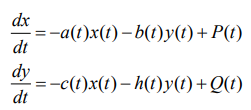
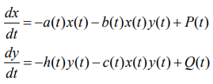

---
## Front matter
lang: ru-RU
title: Лабораторная 3
author: |
	Nikolay Shuvalov\inst{1}
	
institute: |
	\inst{1}RUDN University, Moscow, Russian Federation
	
date: 2021, 27 February

## Formatting
mainfont: Times New Roman
romanfont: Times New Roman
sansfont: Times New Roman
monofont: Times New Roman
toc: false
slide_level: 2
theme: metropolis
header-includes:
- \metroset{progressbar=frametitle,sectionpage=progressbar,numbering=fraction}
- '\makeatletter'
- '\beamer@ignorenonframefalse'
- '\makeatother'
aspectratio: 43
section-titles: true
---

## Цель работы

Познакомиться с моделью боевых действий.

## Теоретическая справка

Рассмотрим некоторые простейшие модели боевых действий – модели
Ланчестера. В противоборстве могут принимать участие как регулярные войска,
так и партизанские отряды. В общем случае главной характеристикой соперников
являются численности сторон. Если в какой-то момент времени одна из
численностей обращается в нуль, то данная сторона считается проигравшей (при
условии, что численность другой стороны в данный момент положительна).
Рассмотри три случая ведения боевых действий.

## Теоретическая справка

1. Боевые действия между регулярными войсками

Модель боевых действий между регулярными войсками
описывается следующим образом(рис. -@fig:001)

{ #fig:001 width=70% }

## Теоретическая справка

2. Боевые действия с участием регулярных войск и партизанских
отрядов 

Модель боевых действий с участием регулярных войск и партизанских
отрядов описывается следующим образом(рис. -@fig:002)

{ #fig:002 width=70% }

## Теоретическая справка

3. Боевые действия между партизанскими отрядами 

Модель боевых действий между партизанскими отрядами
описывается следующим образом(рис. -@fig:003)

{ #fig:003 width=70% }

## Выполнение лабораторной работы

Построил график для первого случая (рис. -@fig:007)

{ #fig:007 width=70% }

Победу одержала армия X

## Выполнение лабораторной работы

Построил график для второго случая (рис. -@fig:008)

{ #fig:008 width=70% }

Победу одержала армия X

## Результат

Познакомились с моделью боевых действий.
