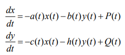
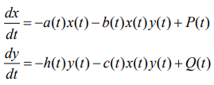
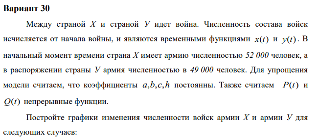
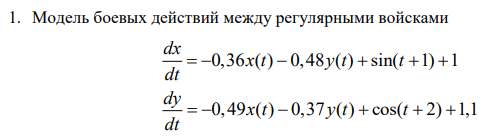
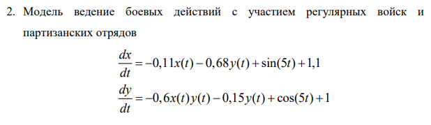

---
# Front matter
lang: ru-RU
title: "Отчёта по лабораторной работе №3"
subtitle: "Модель боевых действий"
author: "Шувалов Николай Константинович"

# Formatting
toc-title: "Содержание"
toc: true # Table of contents
toc_depth: 2
lof: true # List of figures
lot: true # List of tables
fontsize: 12pt
linestretch: 1.5
papersize: a4paper
documentclass: scrreprt
polyglossia-lang: russian
polyglossia-otherlangs: english
mainfont: PT Serif
romanfont: PT Serif
sansfont: PT Sans
monofont: PT Mono
mainfontoptions: Ligatures=TeX
romanfontoptions: Ligatures=TeX
sansfontoptions: Ligatures=TeX,Scale=MatchLowercase
monofontoptions: Scale=MatchLowercase
indent: true
pdf-engine: lualatex
header-includes:
  - \linepenalty=10 # the penalty added to the badness of each line within a paragraph (no associated penalty node) Increasing the value makes tex try to have fewer lines in the paragraph.
  - \interlinepenalty=0 # value of the penalty (node) added after each line of a paragraph.
  - \hyphenpenalty=50 # the penalty for line breaking at an automatically inserted hyphen
  - \exhyphenpenalty=50 # the penalty for line breaking at an explicit hyphen
  - \binoppenalty=700 # the penalty for breaking a line at a binary operator
  - \relpenalty=500 # the penalty for breaking a line at a relation
  - \clubpenalty=150 # extra penalty for breaking after first line of a paragraph
  - \widowpenalty=150 # extra penalty for breaking before last line of a paragraph
  - \displaywidowpenalty=50 # extra penalty for breaking before last line before a display math
  - \brokenpenalty=100 # extra penalty for page breaking after a hyphenated line
  - \predisplaypenalty=10000 # penalty for breaking before a display
  - \postdisplaypenalty=0 # penalty for breaking after a display
  - \floatingpenalty = 20000 # penalty for splitting an insertion (can only be split footnote in standard LaTeX)
  - \raggedbottom # or \flushbottom
  - \usepackage{float} # keep figures where there are in the text
  - \floatplacement{figure}{H} # keep figures where there are in the text
---

# Цель работы

Познакомиться с моделью боевых действий.

# Задание

1.Построить графики изменения численности войск армии Х и армии У для следующих случаев: Модель боевых действий между регулярными войсками; Модель ведение боевых действий с участием регулярных войск и партизанских отрядов

2.Определить победителя

# Теоретическая справка

Рассмотрим некоторые простейшие модели боевых действий – модели
Ланчестера. В противоборстве могут принимать участие как регулярные войска,
так и партизанские отряды. В общем случае главной характеристикой соперников
являются численности сторон. Если в какой-то момент времени одна из
численностей обращается в нуль, то данная сторона считается проигравшей (при
условии, что численность другой стороны в данный момент положительна).

Рассмотри три случая ведения боевых действий:

1. Боевые действия между регулярными войсками

Модель боевых действий между регулярными войсками
описывается следующим образом(рис. -@fig:001)

{ #fig:001 width=70% }


2. Боевые действия с участием регулярных войск и партизанских
отрядов 

Модель боевых действий с участием регулярных войск и партизанских
отрядов описывается следующим образом(рис. -@fig:002)

{ #fig:002 width=70% }


3. Боевые действия между партизанскими отрядами 

Модель боевых действий между партизанскими отрядами
описывается следующим образом(рис. -@fig:003)

{ #fig:003 width=70% }


# Выполнение лабораторной работы

Условие задачи (рис. -@fig:004)

{ #fig:004 width=70% }

Первый случай (рис. -@fig:005)

{ #fig:005 width=70% }

Второй случай (рис. -@fig:006)

{ #fig:006 width=70% }

Написал код:
```
import numpy as np
import matplotlib.pyplot as plt
import math
from scipy.integrate import odeint
x0 = 52000 
y0 = 49000
a1 = 0.36
b1 = 0.48
c1 = 0.49
h1 = 0.37
a2 = 0.11
b2 = 0.68
c2 = 0.6
h2 = 0.15
t0 = 0
tmax = 4
dt = 0.05
x0 = 52000 
y0 = 49000
a1 = 0.36
b1 = 0.48
c1 = 0.49
h1 = 0.37
a2 = 0.11
b2 = 0.68
c2 = 0.6
h2 = 0.15
t0 = 0
tmax = 4
dt = 0.05

def P1(t):
    p = math.sin(t+1)+1
    return p

def Q1(t):
    q = math.cos(t+2)+1.1
    return q

def f1(y,t):
    x1,y1 = y
    return[-a1*x1-b1*y1+P1(t), -c1*x1-h1*y1+Q1(t)]

def P2(t):
    p = math.sin(5*t)+1
    return p

def Q2(t):
    q = math.cos(5*t)+1
    return q

def f2(y,t):
    x2,y2 = y
    return[-a2*x2-b2*y2+P2(t), -c2*x2*y2-h2*y2+Q2(t)]
	
t = np.linspace( t0, tmax, 100)
v0= [x0, y0]
y = odeint(f1, v0, t)
x11 = y[:,0]
y11 = y[:,1]
fig1 = plt.figure()
plt.plot(t, x11,'r')
plt.plot(t, y11,'b')
plt.title("Модель боевых действий №1")
plt.xlabel("время")
plt.ylabel("численность армии")
plt.grid(True)
plt.show()

t = np.linspace( t0, tmax, 100)
v0= [x0, y0]
y = odeint(f1, v0, t)
x11 = y[:,0]
y11 = y[:,1]
fig1 = plt.figure()
plt.plot(t, x11,'r')
plt.plot(t, y11,'b')
plt.title("Модель боевых действий №1")
plt.xlabel("время")
plt.ylabel("численность армии")
plt.grid(True)
plt.show()
```

Построил график для первого случая (рис. -@fig:007)

{ #fig:007 width=70% }

Победу одержала армия X


Построил график для второго случая (рис. -@fig:008)

{ #fig:008 width=70% }

Победу одержала армия X

# Выводы

Познакомились с моделью боевых действий.

