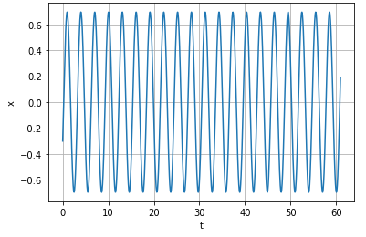
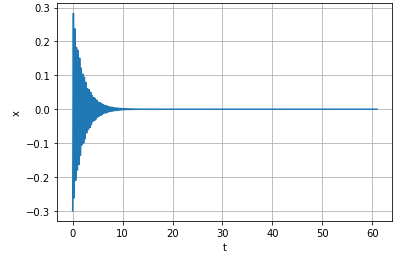
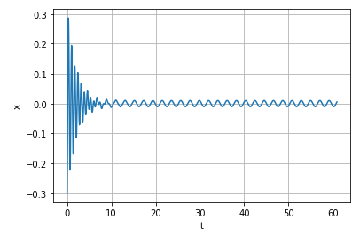
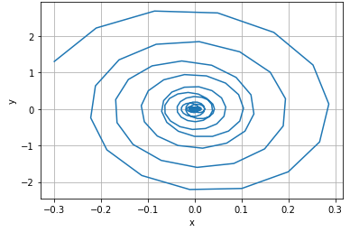

---
## Front matter
lang: ru-RU
title: Лабораторная 4
author: |
	Nikolay Shuvalov\inst{1}
	
institute: |
	\inst{1}RUDN University, Moscow, Russian Federation
	
date: 2021, 27 February

## Formatting
mainfont: Times New Roman
romanfont: Times New Roman
sansfont: Times New Roman
monofont: Times New Roman
toc: false
slide_level: 2
theme: metropolis
header-includes:
- \metroset{progressbar=frametitle,sectionpage=progressbar,numbering=fraction}
- '\makeatletter'
- '\beamer@ignorenonframefalse'
- '\makeatother'
aspectratio: 43
section-titles: true
---

## Цель работы

Познакомиться с моделью гармонических колебаний.

## Теоретическая справка

Движение грузика на пружинке, маятника, заряда в электрическом контуре, а также эволюция во 
времени многих систем в физике, химии, биологии и других науках при определенных предположениях 
можно описать одним и тем же дифференциальным уравнением, которое в теории колебаний 
выступает в качестве основной модели. Эта модель называется линейным гармоническим 
осциллятором. Уравнение свободных колебаний гармонического осциллятора имеет следующий вид: 
$$\ddot{x}+2\gamma\dot{x}+\omega_0^2=0$$
где $x$ - переменная, описывающая состояние системы (смещение грузика, заряд конденсатора и т.д.), 
$\gamma$ - параметр, характеризующий потери энергии (трение в механической системе, 
сопротивление в контуре), $\omega_0$ - собственная частота колебаний. 

## Теоретическая справка
Это уравнение есть линейное однородное дифференциальное уравнение 
второго порядка и оно является примером линейной динамической системы.
При отсутствии потерь в системе ( $\gamma=0$ ) получаем уравнение консервативного осциллятора 
энергия колебания которого сохраняется во времени. 
$$\ddot{x}+\omega_0^2x=0$$
Для однозначной разрешимости уравнения второго порядка необходимо задать два начальных 
условия вида
$$ \begin{cases} x(t_0)=x_0 \
\dot{x(t_0)}=y_0 \end{cases} $$
Уравнение второго порядка можно представить в виде системы двух уравнений первого порядка: 
$$ \begin{cases} x=y \
y=-\omega_0^2x \end{cases} $$

## Теоретическая справка

Начальные условия для системы примут вид: $$ \begin{cases} x(t_0)=x_0 \
y(t_0)=y_0 \end{cases} $$

Независимые переменные $x, y$ определяют пространство, в котором «движется» решение. Это 
фазовое пространство системы, поскольку оно двумерно будем называть его фазовой плоскостью. 
Значение фазовых координат $x, y$ в любой момент времени полностью определяет состояние 
системы. Решению уравнения движения как функции времени отвечает гладкая кривая в фазовой 
плоскости. Она называется фазовой траекторией. Если множество различных решений 
(соответствующих различным начальным условиям) изобразить на одной фазовой плоскости, возникает 
общая картина поведения системы. Такую картину, образованную набором фазовых траекторий, 
называют фазовым портретом.

## Выполнение лабораторной работы

{ #fig:002 width=70% }

## Выполнение лабораторной работы

{ #fig:003 width=70% }

## Выполнение лабораторной работы

{ #fig:004 width=70% }

## Выполнение лабораторной работы

{ #fig:005 width=70% }

## Выполнение лабораторной работы

{ #fig:006 width=70% }

## Выполнение лабораторной работы

{ #fig:007 width=70% }

## Результат

Познакомились с моделью гармонических колебаний.

