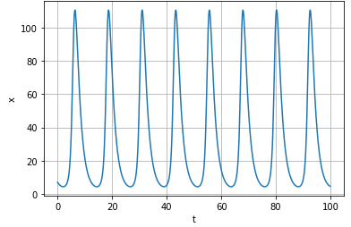
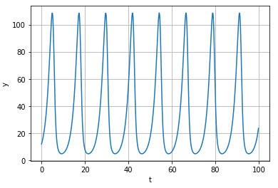
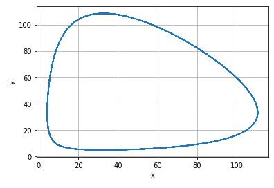

---
## Front matter
lang: ru-RU
title: Лабораторная 5
author: |
	Nikolay Shuvalov\inst{1}
	
institute: |
	\inst{1}RUDN University, Moscow, Russian Federation
	
date: 2021, 27 February

## Formatting
mainfont: Times New Roman
romanfont: Times New Roman
sansfont: Times New Roman
monofont: Times New Roman
toc: false
slide_level: 2
theme: metropolis
header-includes:
- \metroset{progressbar=frametitle,sectionpage=progressbar,numbering=fraction}
- '\makeatletter'
- '\beamer@ignorenonframefalse'
- '\makeatother'
aspectratio: 43
section-titles: true
---

## Цель работы

Познакомиться с моделью хищник-жертва.

## Задание

1. Построить график зависимостиx от y и графики функций x(t), y(t)
2. Найти стационарное состояние системы

## Теоретическая справка

Простейшая модель взаимодействия двух видов типа «хищник — жертва» -
модель Лотки-Вольтерры. Данная двувидовая модель основывается на
следующих предположениях:

1. Численность популяции жертв x и хищников y зависят только от времени
(модель не учитывает пространственное распределение популяции на
занимаемой территории)
2. В отсутствии взаимодействия численность видов изменяется по модели
Мальтуса, при этом число жертв увеличивается, а число хищников падает

## Теоретическая справка

3. Естественная смертность жертвы и естественная рождаемость хищника
считаются несущественными
4. Эффект насыщения численности обеих популяций не учитывается
5. Скорость роста численности жертв уменьшается пропорционально
численности хищников

## Теоретическая справка

$$ \begin{cases} \frac{dx}{dt} = (-ax(t) + by(t)x(t)) \
\frac{dy}{dt} = (cy(t) - dy(t)x(t)) \end{cases} $$
В этой модели x – число жертв, y - число хищников. Коэффициент a
описывает скорость естественного прироста числа жертв в отсутствие хищников, с
- естественное вымирание хищников, лишенных пищи в виде жертв. Вероятность
взаимодействия жертвы и хищника считается пропорциональной как количеству
жертв, так и числу самих хищников (xy). Каждый акт взаимодействия уменьшает
популяцию жертв, но способствует увеличению популяции хищников (члены -bxy
и dxy в правой части уравнения).

## Теоретическая справка

Стационарное состояние системы (положение равновесия, не зависящее
от времени решение) будет в точке: $$ x_0=\frac{a}{b}, y_0=\frac{c}{d} $$

## Выполнение лабораторной работы

{ #fig:003 width=70% }

## Выполнение лабораторной работы

{ #fig:004 width=70% }

## Выполнение лабораторной работы

{ #fig:005 width=70% }

Стационарное состояние $x_0=32.777, y_0=33.157$

## Результат

Познакомились с моделью хищник-жертва.

