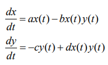
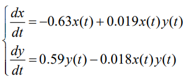
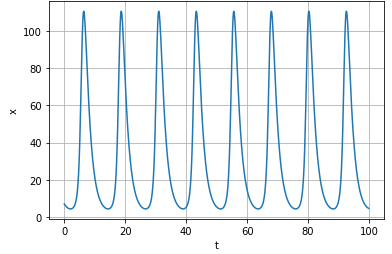
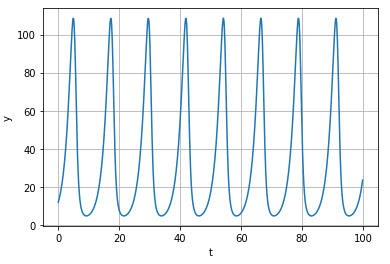

---
# Front matter
lang: ru-RU
title: "Отчёта по лабораторной работе №5"
subtitle: "Модель хищник-жертва"
author: "Шувалов Николай Константинович"

# Formatting
toc-title: "Содержание"
toc: true # Table of contents
toc_depth: 2
lof: true # List of figures
lot: true # List of tables
fontsize: 12pt
linestretch: 1.5
papersize: a4paper
documentclass: scrreprt
polyglossia-lang: russian
polyglossia-otherlangs: english
mainfont: PT Serif
romanfont: PT Serif
sansfont: PT Sans
monofont: PT Mono
mainfontoptions: Ligatures=TeX
romanfontoptions: Ligatures=TeX
sansfontoptions: Ligatures=TeX,Scale=MatchLowercase
monofontoptions: Scale=MatchLowercase
indent: true
pdf-engine: lualatex
header-includes:
  - \linepenalty=10 # the penalty added to the badness of each line within a paragraph (no associated penalty node) Increasing the value makes tex try to have fewer lines in the paragraph.
  - \interlinepenalty=0 # value of the penalty (node) added after each line of a paragraph.
  - \hyphenpenalty=50 # the penalty for line breaking at an automatically inserted hyphen
  - \exhyphenpenalty=50 # the penalty for line breaking at an explicit hyphen
  - \binoppenalty=700 # the penalty for breaking a line at a binary operator
  - \relpenalty=500 # the penalty for breaking a line at a relation
  - \clubpenalty=150 # extra penalty for breaking after first line of a paragraph
  - \widowpenalty=150 # extra penalty for breaking before last line of a paragraph
  - \displaywidowpenalty=50 # extra penalty for breaking before last line before a display math
  - \brokenpenalty=100 # extra penalty for page breaking after a hyphenated line
  - \predisplaypenalty=10000 # penalty for breaking before a display
  - \postdisplaypenalty=0 # penalty for breaking after a display
  - \floatingpenalty = 20000 # penalty for splitting an insertion (can only be split footnote in standard LaTeX)
  - \raggedbottom # or \flushbottom
  - \usepackage{float} # keep figures where there are in the text
  - \floatplacement{figure}{H} # keep figures where there are in the text
---

# Цель работы

Познакомиться с моделью хищник-жертва.

# Задание

1. Построить график зависимостиx от y и графики функций x(t), y(t)
2. Найти стационарное состояние системы


# Теоретическая справка

Простейшая модель взаимодействия двух видов типа «хищник — жертва» -
модель Лотки-Вольтерры. Данная двувидовая модель основывается на
следующих предположениях:
1. Численность популяции жертв x и хищников y зависят только от времени
(модель не учитывает пространственное распределение популяции на
занимаемой территории)
2. В отсутствии взаимодействия численность видов изменяется по модели
Мальтуса, при этом число жертв увеличивается, а число хищников падает
3. Естественная смертность жертвы и естественная рождаемость хищника
считаются несущественными
4. Эффект насыщения численности обеих популяций не учитывается
5. Скорость роста численности жертв уменьшается пропорционально
численности хищников

{ #fig:001 width=70% }

В этой модели x – число жертв, y - число хищников. Коэффициент a
описывает скорость естественного прироста числа жертв в отсутствие хищников, с
- естественное вымирание хищников, лишенных пищи в виде жертв. Вероятность
взаимодействия жертвы и хищника считается пропорциональной как количеству
жертв, так и числу самих хищников (xy). Каждый акт взаимодействия уменьшает
популяцию жертв, но способствует увеличению популяции хищников (члены -bxy
и dxy в правой части уравнения). 

Стационарное состояние системы (положение равновесия, не зависящее
от времени решение) будет в точке: $$ x_0=\frac{a}{b}, y_0=\frac{c}{d} $$

# Выполнение лабораторной работы

Для модели «хищник-жертва»:

{ #fig:002 width=70% }

Постройте график зависимости численности хищников от численности жертв,
а также графики изменения численности хищников и численности жертв при 
следующих начальных условиях: $x_0=7, y_0=12$. Найдите стационарное
состояние системы.

Написал код:
```
import numpy as np
import math
import matplotlib.pyplot as plt
from scipy.integrate import odeint
a = 0.63
b = 0.019
c = 0.59
d = 0.018
y0 = [7, 12]
def syst2(y,t):
    y1,y2 = y
    return[-a*y1+b*y1*y2, c*y2-d*y1*y2]
t = np.arange(0, 100, 0.1)
y = odeint(syst2, y0, t)
y11 = y[:,0]
y21 = y[:,1]

fig1 = plt.figure()
plt.plot(t, y11)
plt.xlabel("t")
plt.ylabel("x")
plt.grid(True)
plt.show()     
  
fig2 = plt.figure()
plt.plot(t, y21)
plt.xlabel("t")
plt.ylabel("y")
plt.grid(True)
plt.show()

fig3 = plt.figure()
plt.plot(y11, y21)
plt.xlabel("x")
plt.ylabel("y")
plt.grid(True)
plt.show()
print("Стационарное состояние системы будет в точке:
x0 = ", c/d,", y0 = ",a/b)

```
{ #fig:003 width=70% }

{ #fig:004 width=70% }

{ #fig:005 width=70% }

Стационарное состояние $x_0=32.777, y_0=33.157$


# Выводы

Познакомились с моделью хищник-жертва.

