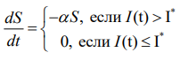
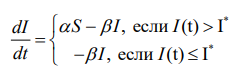
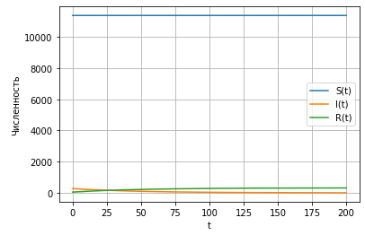
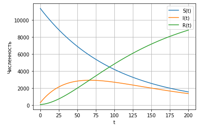

---
## Front matter
lang: ru-RU
title: Лабораторная 6
author: |
	Nikolay Shuvalov\inst{1}
	
institute: |
	\inst{1}RUDN University, Moscow, Russian Federation
	
date: 2021, 27 February

## Formatting
mainfont: Times New Roman
romanfont: Times New Roman
sansfont: Times New Roman
monofont: Times New Roman
toc: false
slide_level: 2
theme: metropolis
header-includes:
- \metroset{progressbar=frametitle,sectionpage=progressbar,numbering=fraction}
- '\makeatletter'
- '\beamer@ignorenonframefalse'
- '\makeatother'
aspectratio: 43
section-titles: true
---

## Цель работы

Познакомиться с моделью заражения SIR.

## Задание

1. Построить графики изменения числа особей в каждой из трех групп. 
2. Рассмотреть, как будет протекать эпидемия в случае: 
- если $I(0)\leq I^*$
- если $I(0)>I^*$

## Теоретическая справка

Рассмотрим простейшую модель эпидемии. Предположим, что некая
популяция, состоящая из N особей, (считаем, что популяция изолирована)
подразделяется на три группы. Первая группа - это восприимчивые к болезни, но
пока здоровые особи, обозначим их через S(t). Вторая группа – это число
инфицированных особей, которые также при этом являются распространителями
инфекции, обозначим их I(t). А третья группа, обозначающаяся через R(t) – это
здоровые особи с иммунитетом к болезни.

## Теоретическая справка

До того, как число заболевших не превышает критического значения $I^*$
считаем, что все больные изолированы и не заражают здоровых. Когда I(t) > $I^*$
тогда инфицирование способны заражать восприимчивых к болезни особей. 
Таким образом, скорость изменения числа S(t) меняется по следующему
закону:

{ #fig:001 width=70% }

## Теоретическая справка

Поскольку каждая восприимчивая к болезни особь, которая, в конце концов,
заболевает, сама становится инфекционной, то скорость изменения числа
инфекционных особей представляет разность за единицу времени между
заразившимися и теми, кто уже болеет и лечится, т.е.:

{ #fig:002 width=70% }

## Теоретическая справка

А скорость изменения выздоравливающих особей (при этом приобретающие
иммунитет к болезни)
$$\frac{dR}{dT} = \beta I$$
Постоянные пропорциональности $\alpha, \beta$  - это коэффициенты заболеваемости
и выздоровления соответственно. Для того, чтобы решения соответствующих уравнений определялось
однозначно, необходимо задать начальные условия .Считаем, что на началоэпидемии в момент времени
t = 0 нет особей с иммунитетом к болезни R(0)=0,  а число инфицированных и восприимчивых 
к болезни особей I(0) и S(0) соответственно.

## Выполнение лабораторной работы

{ #fig:004 width=70% }

## Выполнение лабораторной работы

{ #fig:005 width=70% }

## Результат

Познакомились с моделью заражения SIR.

