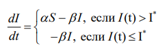
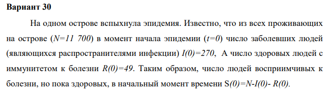

---
# Front matter
lang: ru-RU
title: "Отчёта по лабораторной работе №6"
subtitle: "Задача об эпидемии"
author: "Шувалов Николай Константинович"

# Formatting
toc-title: "Содержание"
toc: true # Table of contents
toc_depth: 2
lof: true # List of figures
lot: true # List of tables
fontsize: 12pt
linestretch: 1.5
papersize: a4paper
documentclass: scrreprt
polyglossia-lang: russian
polyglossia-otherlangs: english
mainfont: PT Serif
romanfont: PT Serif
sansfont: PT Sans
monofont: PT Mono
mainfontoptions: Ligatures=TeX
romanfontoptions: Ligatures=TeX
sansfontoptions: Ligatures=TeX,Scale=MatchLowercase
monofontoptions: Scale=MatchLowercase
indent: true
pdf-engine: lualatex
header-includes:
  - \linepenalty=10 # the penalty added to the badness of each line within a paragraph (no associated penalty node) Increasing the value makes tex try to have fewer lines in the paragraph.
  - \interlinepenalty=0 # value of the penalty (node) added after each line of a paragraph.
  - \hyphenpenalty=50 # the penalty for line breaking at an automatically inserted hyphen
  - \exhyphenpenalty=50 # the penalty for line breaking at an explicit hyphen
  - \binoppenalty=700 # the penalty for breaking a line at a binary operator
  - \relpenalty=500 # the penalty for breaking a line at a relation
  - \clubpenalty=150 # extra penalty for breaking after first line of a paragraph
  - \widowpenalty=150 # extra penalty for breaking before last line of a paragraph
  - \displaywidowpenalty=50 # extra penalty for breaking before last line before a display math
  - \brokenpenalty=100 # extra penalty for page breaking after a hyphenated line
  - \predisplaypenalty=10000 # penalty for breaking before a display
  - \postdisplaypenalty=0 # penalty for breaking after a display
  - \floatingpenalty = 20000 # penalty for splitting an insertion (can only be split footnote in standard LaTeX)
  - \raggedbottom # or \flushbottom
  - \usepackage{float} # keep figures where there are in the text
  - \floatplacement{figure}{H} # keep figures where there are in the text
---

# Цель работы

Познакомиться с моделью заражения SIR.

# Задание

1. Построить графики изменения числа особей в каждой из трех групп. 
2. Рассмотреть, как будет протекать эпидемия в случае: 
- если $I(0)\leq I^*$
- если $I(0)>I^*$


# Теоретическая справка

	Рассмотрим простейшую модель эпидемии. Предположим, что некая
популяция, состоящая из N особей, (считаем, что популяция изолирована)
подразделяется на три группы. Первая группа - это восприимчивые к болезни, но
пока здоровые особи, обозначим их через S(t). Вторая группа – это число
инфицированных особей, которые также при этом являются распространителями
инфекции, обозначим их I(t). А третья группа, обозначающаяся через R(t) – это
здоровые особи с иммунитетом к болезни.

До того, как число заболевших не превышает критического значения $I^*$
считаем, что все больные изолированы и не заражают здоровых. Когда I(t) > $I^*$
тогда инфицирование способны заражать восприимчивых к болезни особей. 
Таким образом, скорость изменения числа S(t) меняется по следующему
закону:

{ #fig:001 width=70% }

Поскольку каждая восприимчивая к болезни особь, которая, в конце концов,
заболевает, сама становится инфекционной, то скорость изменения числа
инфекционных особей представляет разность за единицу времени между
заразившимися и теми, кто уже болеет и лечится, т.е.:

{ #fig:002 width=70% }

А скорость изменения выздоравливающих особей (при этом приобретающие
иммунитет к болезни)

$$\frac{dR}{dT} = \beta I$$

Постоянные пропорциональности $\alpha, \beta$  - это коэффициенты заболеваемости
и выздоровления соответственно. Для того, чтобы решения соответствующих уравнений определялось
однозначно, необходимо задать начальные условия .Считаем, что на началоэпидемии в момент времени
t = 0 нет особей с иммунитетом к болезни R(0)=0,  а число инфицированных и восприимчивых 
к болезни особей I(0) и S(0) соответственно.

# Выполнение лабораторной работы

Условие задачи

{ #fig:003 width=70% }

Написал код:
```
import numpy as np
import math
from scipy.integrate import odeint
import matplotlib.pyplot as plt
a = 0.01
b = 0.02 
N = 11700
I0 = 270
R0 = 49
S0 = N-I0-R0
x0 = [S0, I0, R0]

def syst1(y, t):
    y1, y2, y3 = y
    return [0, -b*y2,b*y2]

def syst2(y,t):
    y1,y2,y3 = y
    return [-a*y1, a*y1-b*y2, b*y2]
	
t = np.arange(0, 200, 0.01)
y1 = odeint(syst1, x0, t)
ys = y1[:,0]
yi = y1[:,1]
yr = y1[:,2]

fig1 = plt.figure()
plt.plot(t,ys,label='S(t)')
plt.plot(t,yi,label='I(t)')
plt.plot(t,yr,label='R(t)')
plt.xlabel("t")
plt.ylabel("Численность")
plt.grid(True)
plt.legend()
plt.show()

y2 = odeint(syst2, x0, t)
ys = y2[:,0]
yi = y2[:,1]
yr = y2[:,2]

fig1 = plt.figure()
plt.plot(t,ys,label='S(t)')
plt.plot(t,yi,label='I(t)')
plt.plot(t,yr,label='R(t)')
plt.xlabel("t")
plt.ylabel("Численность")
plt.grid(True)
plt.legend()
plt.show()
```
{ #fig:004 width=70% }

{ #fig:005 width=70% }


# Выводы

Познакомились с моделью заражения SIR.
