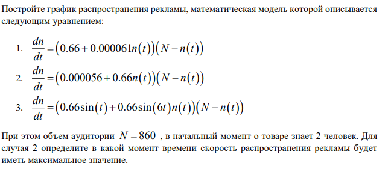
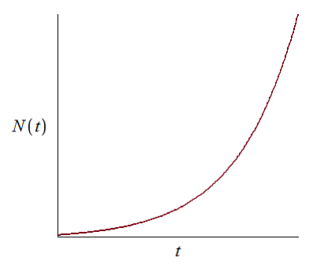
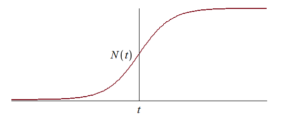
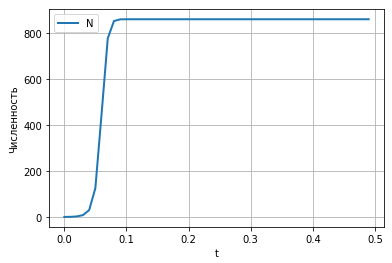
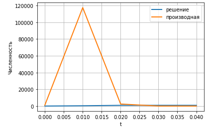
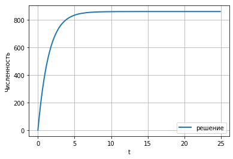

---
# Front matter
lang: ru-RU
title: "Отчёта по лабораторной работе №7"
subtitle: "Эффективность рекламы "
author: "Шувалов Николай Константинович"

# Formatting
toc-title: "Содержание"
toc: true # Table of contents
toc_depth: 2
lof: true # List of figures
lot: true # List of tables
fontsize: 12pt
linestretch: 1.5
papersize: a4paper
documentclass: scrreprt
polyglossia-lang: russian
polyglossia-otherlangs: english
mainfont: PT Serif
romanfont: PT Serif
sansfont: PT Sans
monofont: PT Mono
mainfontoptions: Ligatures=TeX
romanfontoptions: Ligatures=TeX
sansfontoptions: Ligatures=TeX,Scale=MatchLowercase
monofontoptions: Scale=MatchLowercase
indent: true
pdf-engine: lualatex
header-includes:
  - \linepenalty=10 # the penalty added to the badness of each line within a paragraph (no associated penalty node) Increasing the value makes tex try to have fewer lines in the paragraph.
  - \interlinepenalty=0 # value of the penalty (node) added after each line of a paragraph.
  - \hyphenpenalty=50 # the penalty for line breaking at an automatically inserted hyphen
  - \exhyphenpenalty=50 # the penalty for line breaking at an explicit hyphen
  - \binoppenalty=700 # the penalty for breaking a line at a binary operator
  - \relpenalty=500 # the penalty for breaking a line at a relation
  - \clubpenalty=150 # extra penalty for breaking after first line of a paragraph
  - \widowpenalty=150 # extra penalty for breaking before last line of a paragraph
  - \displaywidowpenalty=50 # extra penalty for breaking before last line before a display math
  - \brokenpenalty=100 # extra penalty for page breaking after a hyphenated line
  - \predisplaypenalty=10000 # penalty for breaking before a display
  - \postdisplaypenalty=0 # penalty for breaking after a display
  - \floatingpenalty = 20000 # penalty for splitting an insertion (can only be split footnote in standard LaTeX)
  - \raggedbottom # or \flushbottom
  - \usepackage{float} # keep figures where there are in the text
  - \floatplacement{figure}{H} # keep figures where there are in the text
---

# Цель работы

Познакомиться с моделью эффективности рекламы.

# Задание

{ #fig:001 width=70% }


# Теоретическая справка

Организуется рекламная кампания нового товара или услуги. Необходимо,
чтобы прибыль будущих продаж с избытком покрывала издержки на рекламу.
Вначале расходы могут превышать прибыль, поскольку лишь малая часть
потенциальных покупателей будет информирована о новинке. Затем, при
увеличении числа продаж, возрастает и прибыль, и, наконец, наступит момент,
когда рынок насытиться, и рекламировать товар станет бесполезным.

Предположим, что торговыми учреждениями реализуется некоторая
продукция, о которой в момент времени t из числа потенциальных покупателей
N знает лишь n покупателей. Для ускорения сбыта продукции запускается реклама
по радио, телевидению и других средств массовой информации. После запуска
рекламной кампании информация о продукции начнет распространяться среди
потенциальных покупателей путем общения друг с другом. Таким образом, после
запуска рекламных объявлений скорость изменения числа знающих о продукции
людей пропорциональна как числу знающих о товаре покупателей, так и числу
покупателей о нем не знающих

Модель рекламной кампании описывается следующими величинами.
Считаем, что $\frac{dn}{dt}$ - скорость изменения со временем числа потребителей,
узнавших о товаре и готовых его купить,t - время, прошедшее с начала рекламной
кампании. n(t) - число уже информированных клиентов. Эта величина
пропорциональна числу покупателей, еще не знающих о нем, это описывается
следующим образом: $\alpha _1(t)(N-n(t))$, где N - общее число потенциальных
платежеспособных покупателей, $\alpha _1>0$ - характеризует интенсивность
рекламной кампании (зависит от затрат на рекламу в данный момент времени).
Помимо этого, узнавшие о товаре потребители также распространяют полученную
информацию среди потенциальных покупателей, не знающих о нем (в этом случае
работает т.н. сарафанное радио). Этот вклад в рекламу описывается величиной
$\alpha _2(t)n(t)(N-n(t))$  , эта величина увеличивается с увеличением потребителей
узнавших о товаре. Математическая модель распространения рекламы описывается
уравнением:

$$\frac{dn}{dt} = (\alpha _1(t) + \alpha _2(t)n(t))(N-n(t))$$

При $\alpha _1(t) >> \alpha _2(t)$ получается модель типа модели Мальтуса, решение
которой имеет вид

{ #fig:002 width=70% }

В обратном случае $\alpha _1(t) << \alpha _2(t)$ получаем уравнение логистической кривой

{ #fig:003 width=70% }


# Выполнение лабораторной работы


Написал код:
```
import numpy as np
from scipy. integrate import odeint
import matplotlib.pyplot as plt
import math
t0 = 0
x0 = 2
N = 860

a1 = 0.66
a2 = 0.000061

t = np.arange( t0, 25, 0.1)

def syst(dx, t):
    x = dx
    return (a1 +x*a2)*(N-x)

y = odeint(syst, x0, t)

fig1 = plt.figure()
plt.plot(t, y, linewidth=2, label="решение")
plt.xlabel("t")
plt.ylabel("Численность")
plt.grid(True)
plt.legend()
plt.show()

a1 = 0.000056
a2 = 0.66

t = np.arange( t0, 0.05, 0.01)

y = odeint(syst, x0, t)
dy = (a1 +y*a2)*(N-y)

fig2 = plt.figure()
plt.plot(t, y, linewidth=2, label="решение")
plt.plot(t, dy, linewidth=2, label="производная")
plt.xlabel("t")
plt.ylabel("Численность")
plt.grid(True)
plt.legend()
plt.show()

def a1(t): 
    a1 = 0.66*math.sin(t)
    return a1

def a2(t): 
    a2 = 0.66*math.sin(6*t)
    return a2

t = np.arange( t0, 0.5, 0.01)

def syst2(dx, t):
    x = dx
    return (a1(t) +x*a2(t))*(N-x)

y = odeint(syst2, x0, t)

fig3 = plt.figure()
plt.plot(t, y, linewidth=2, label="N")
plt.xlabel("t")
plt.ylabel("Численность")
plt.grid(True)
plt.legend()
plt.show()
```
{ #fig:004 width=70% }

{ #fig:005 width=70% }

{ #fig:006 width=70% }


# Выводы

Познакомились с моделью эффективности рекламы.
